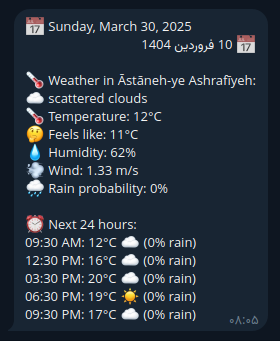

# Telegram Weather Bot 🌤️

A Telegram bot that provides weather information with support for both Gregorian and Jalali calendars.

## Features

- 🌡️ Real-time weather information
- 📅 Dual calendar support (Gregorian & Jalali)
- ⏰ 24-hour weather forecast
- 🌍 Support for multiple cities
- 🔄 Daily weather notifications
- 💾 Default city preference

## Screenshot



## Setup

1. Clone the repository:

```bash
git clone https://github.com/imkarimkarim/t-weather-notif.git
cd t-weather-notif
```

2. Install dependencies:

```bash
npm install
```

3. Create a `.env` file with the following variables:

```env
BOT_TOKEN=your_telegram_bot_token
OPENWEATHER_API_KEY=your_openweather_api_key
CHAT_ID=your_telegram_chat_id
```

4. Build and run:

```bash
npm run build
npm start
```

## Development

Run in development mode with hot reload:

```bash
npm run dev
```

## Commands

- `/start` - Start the bot
- `/weather <city>` - Get weather for a specific city
- `/setdefault <city>` - Set your default city
- `/reset` - Reset to default city (Astaneh-ye Ashrafiyeh)
- `/help` - Show available commands

## Requirements

- Node.js >= 22.14.0
- Telegram Bot Token
- OpenWeather API Key

## License

ISC
